# 代码逻辑

## 代码构成

+ 游戏初始化

+ 游戏主循环

+ 游戏后台

## 代码详解

### 一、游戏初始化

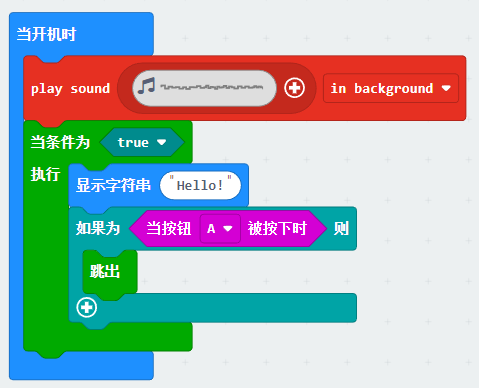

> 在游戏开始时，播放初始化音乐，检测“A”键是否按下，如果按下，则开始游戏。

### 二、游戏后台

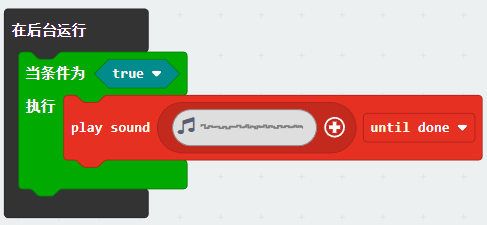

> 循环播放背景音乐

### 三、游戏主循环

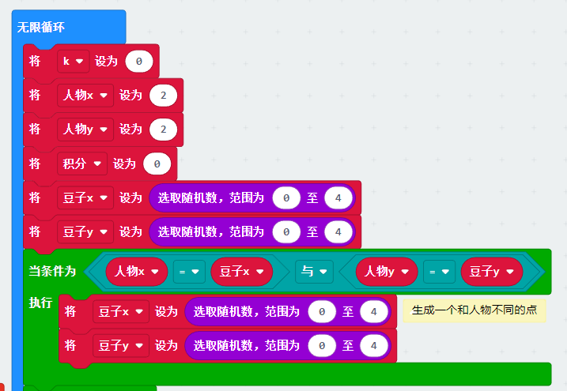

> 每次开始游戏，都需要初始化游戏，包括人物的位置、豆子的位置、得分等。
>> 其中，每次游戏开局人物位置固定，豆子的位置是随机的。

代码下面有一段是为了防止生成的随机豆子与人物重合而设置的。

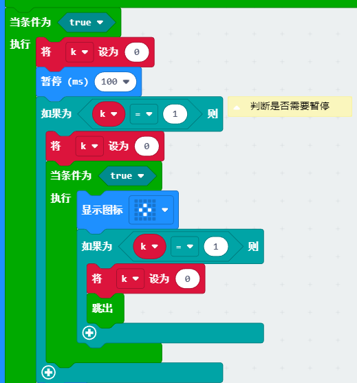

> 下面的代码是判断是否需要暂停游戏。具体的逻辑是：
>> 如果按下“A”和“B”键，则暂停游戏；在按AB间的时候会有k值得变化，当确定需要暂停后，我们需要注意将k值设置为0，这样就可以再次判断是否继续游戏。

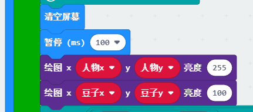

> 这里采用了修改点阵屏亮度的方式提高人物与豆子的辨识度。

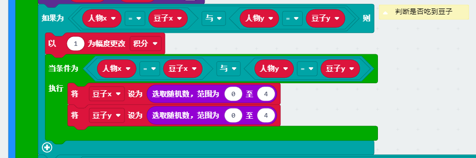

> 当吃到豆子的时候，即为豆子和人的xy值相同，这时计算得分，并且重新生成豆子。

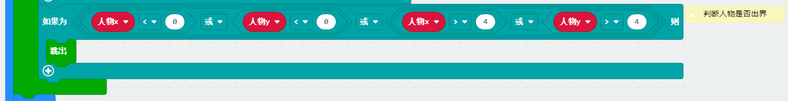

> 当人物走出屏幕的时候，则判断为游戏结束。

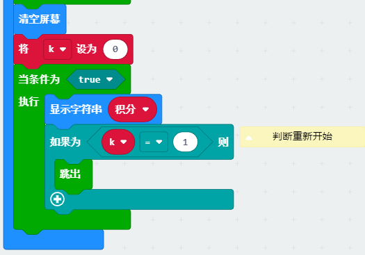

> 当游戏结束后，显示最终的得分，并且进入是否需要重新开始的判断。

### 四、游戏操作

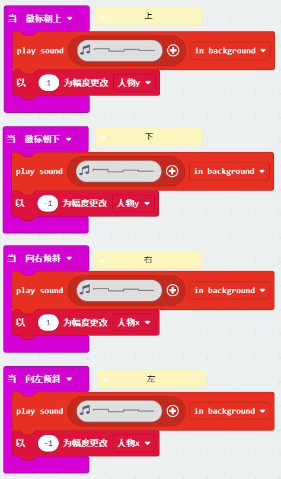

> 我们分别采用转动板子来实现人物的移动，需要注意人物上下移动时的逻辑，徽标朝上，实际指的是我们向下反转板子及人物下移；徽标朝下，实际指的是我们向上反转板子及人物上移。

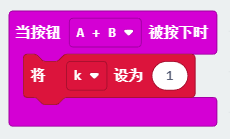

> 最后一块就是k值修改的部分。

## 补充说明

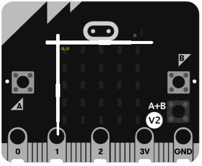

> 我们规定左上角为(0,0)，右下角为(4，4)，这样方便我们计算人物的位置。向下移动时，人物的y值加1，向上移动时，人物的y值减1。同理，向左移动时，人物的x值减1，向右移动时，人物的x值加1。
